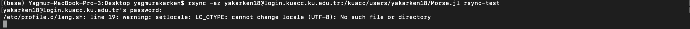

# How do I copy files/data to the HPC Machines?
:sos: You do not need to be logged in to your HPC Cluster account while using these commands.

:sos: If you are using zsh terminal on your Mac, you can have this error:

`/etc/profile.d/lang.sh: line 19: warning: setlocale: LC_CTYPE: cannot change locale (UTF-8): No such file or directory`

Despite this error the commands work. But if you want to solve the problem, you can follow the steps in [here] (https://www.fatalerrors.org/a/warning-setlocale-lc_ctype-cannot-change-locale-utf-8-no-such-file-or-directory.html).

## If you are on campus:
### Windows
Use MobaXterm. This is a GUI-based scp client for MS Windows-based computers that has a drag-and-drop
facility and an inbuilt file editor. If you have cygwin installed, you can open a cygwin-terminal and then use ssh the
same as Linux and Mac below.\
● [Download MobaXterm] (https://mobaxterm.mobatek.net/documentation.html#2_3_3)

### Linux and Mac
**scp  on terminal:**\
`scp file-to-name USERNAME@login.kuacc.ku.edu.tr:/HOME_DIR/SUB_FOLDER/new-filename`

This will copy the file to a SUB_FOLDER and renaming it to new-filename. The destination folder must be a valid address. So SUB_FOLDER must be an existing folder.\

As an example, lets copy a file from Desktop to home folder of HPC Cluster:

In my cluster account, I have Morse.jl, logs and workfolder folders.


Then, on my local computer’ terminal I am writing scp command and copying file named main.py to my home folder on cluster renamed as geohash.py. By the way since I am a Mac user, I see the error, which was mentioned before.


Then, I login to HPC Cluster again and check whether file exist or not.


**rsync on terminal:**

rsync is a fast and versatile command-line utility for synchronizing files and directories between two locations over a remote shell, or from/to a remote Rsync daemon. You will be using rsync for most of the time. It provides fast incremental file transfer by transferring only the differences between the source and the destination.

- Local to local:\
`rsync [OPTION]... [SRC]... DEST`

- Local to remote:\
`rsync [OPTION]... [SRC]... [USER@]HOST:DEST`

- Remote to local:\
`rsync [OPTION]... [USER@]HOST:SRC... [DEST]`

- Zip the transferred file from remote to local:\
`rsync -z USERNAME@host:relative path of the file/folder destination`

- Transfer all files from remote to local:\
`rsync -a USERNAME@host:relative path of the file/folder destination`


Now, lets copy Morse.jl folder which is on cluster to the Destop under the folder which is named as rsync-test.
In my cluster account, this time, I have Morse.jl, logs, work folder and goehash.py


Then I use the rsync command and since I want all files I use -a option. I give the path of Morse.jl under cluster folder and destination as rsync-test. Since I do not have rsync-test folder, it will create automatically.



Then, I check whether I have rsync-test folder and Morse.jl folder under it on my local.


**sftp or ftp client:**\
Windows: Mobaxterm, Winscp, Filezilla\
Linux: sftp, Filezilla\
Mac: Cyberduck, Filezilla\
 
Note: You should use following parameters.\

Host: login.kuacc.ku.edu.tr\
Username: KU-username\
Password: KU-password\
Port:22\

## If you are off campus:
### Google Drive/Dropbox:
If your data is big and you are using VPN, previous solutions can be slow to copy files. You can use rclone tool with your Google Drive/Dropbox.\
Firstly, you need to register to your Gdrive/Dropbox account. Then, you can follow the steps on:\
(https://www.howtogeek.com/451262/how-to-use-rclone-to-back-up-to-google-drive-on-linux/)

```
rclone mkdir remote:folder
rclone ls remote:folder
rclone lsd remote:folder
rclone copy remote:folder  destination_folder
```
You can find extended command list [here] (https://rclone.org/commands/).\

### Mount your home folder over ssh(sshfs):
This option is not very recommended but you can find the necessary documentation on:\
(https://www.digitalocean.com/community/tutorials/how-to-use-sshfs-to-mount-remote-file-systems-over-ssh)


After adding the necessary software, if you are a Linux user, create a directory under mnt folder:
`sudo mkdir /mnt/mountfolder`

If you are a MacOS user, create a folder which you has write and read permissions:


For this example, we will mount workfolder on the cluster to the mountFolder.


Write the necessary sshfs command from your local terminal or tool that you use:\

`sshfs USERNAME@HOST:destination-of-folder-which-will-be-mounted destination-of-target-folder`


Now, let’s check the mountFolder content:


