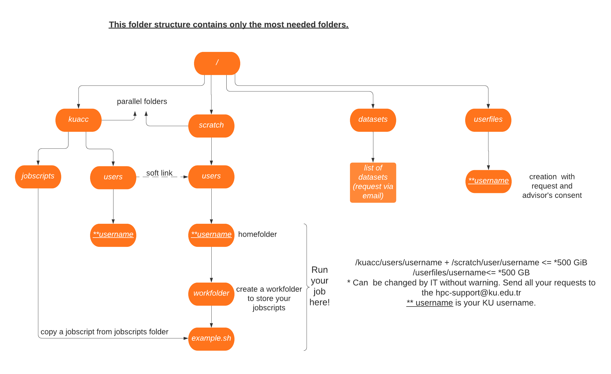

# How to Use Storage?

## User Home Folder (/kuacc/users/username or /scratch/users/username):
User Home folder is a parallel file system. Following precautions should be taken against system failures.
- Do not download datasets under Home folder. 
- Max allowed disk usage limit is 500 GiB per user. However, this limit can be changed without warning depending on total disk usage. 
- Users always need to review his/her home disk, remove unnecessary files and move finished data into his/her personal storage areas (harddisk, gdrive etc.).  When you are done with your project, put it to your personal storage (HDD, drive etc.) because they can be deleted any time from cluster. 
- Users having files over one years old is warned via email to move data from home folders. If disk usage limit is exceeded, user is informed via email. User should take an action and keep home folder size under limits. 
- If user disk usage is over limits despite information emails, users’s account is suspended without warning. If your account is suspended, you can request re-activation via IT-trackit. You need to inform your supervisor and add as Request participant in your trackit. 
- No backup. Users are responsible to take backups. You can use google drive or personal HDDs for backup.

## Datasets Folder(/datasets):
General datasets are kept under /datasets folder.
- Do not download datasets under your home directory. 
- datasets folder is read-only from all nodes. User is not allowed to write in datasets folder. 
- You can request datasets by sending email to it@ku.edu.tr or IT-trackit. Please include dataset and download links. Also, add “HPC Dataset Request” as Subject. 
- Datasets are extracted from zip folders and are mostly kept without changing. 
- If there is a change in folder structure, it is noted in README files. Please read README files in dataset folder. If you need to change datasets name or dataset folder structure, you can use soft links and create a link folder under your home folder. Exp: following command create a link under your home folder.

```
cd
mkdir CID
ln -s /datasets/cid/CID_train_set/2019_01_01_01_20_04_277/JPEG_2019_01_01_01_20_08_673.jpg CID/image1.jpeg
```

## Userfiles Folder(/userfiles):
Userfiles folder is slow disk storage and used for private datasets.
- A user folder is opened upon a Trackit request. User needs to inform his/her advisor. 
- Only private datasets and in-active data are kept. In-active data means user data related to research, but actively not used in process. This is a precaution to keep scratch disk clean. 
- In-active data which is older than 6 months should be removed from disks. 
- Max allowed disk usage limit is 500GB per user. 
- Research group members can add disks into system and increase disk usage limit. Also, have separate folder. Exp: kuttam 
- Read&Write on login nodes. 
- Read-only on compute nodes. This is because userfiles disks are slow. If a user submits a job and writes to userfiles folder, it would cause performance issues. No-backup.