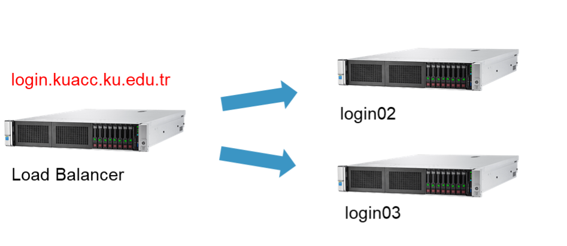

# KUACC HPC (High Performance Computing) Cluster
An HPC cluster is a collection of separate servers (computers), called nodes, which are connected via a fast networking.
Koç University has been providing high-performance computing (HPC) infrastructure to KU researchers since 2004. Current system was in 2017 by using existing network infrastructure and compute nodes. A new file system and sersvice nodes were provided by IT. It started production on December 22, 2017.

**HPC systems have following components:**
- Login Nodes 
-  Compute Nodes 
- Service Nodes - Load Balancer, headnode, ntp servers, mysql 
- Network Infrastructure - High speed network (infiniband, omnipath) 
- Storage – Faster, scalable, parallel file system

## Login Nodes :
Login nodes are shared with all users, so no resource intensive processes may be run on the login nodes. The purpose of a login node is to prepare to run a program (e.g., moving and editing files and compiling).
There are two login nodes on KUACC HPC Cluster. They are behind a load balancer. When user connect to login.kuacc.ku.edu.tr via ssh, connection is forwarded to one of login nodes.

| Login Nodes | Specifications |
| ----------- | ----------- |
| login02 | 2 x Intel(R) Xeon(R) CPU E5-2695 v4 @ 2.10GHz, 2x18cores(36cores), 16×32 (512G) RAM, 1x Quadro M2000 GPU, 1 x Tesla P4 GPU 8GB |
| login03 | 2 x Intel(R) Xeon(R) CPU E5-2695 v4 @ 2.10GHz, 2x18cores(36cores), 16×32 (512G) RAM, 1x Quadro M2000 GPU, 1 x Tesla P4 GPU |

## Compute Nodes :
Compute nodes are for running the program. Any process that uses a non-trivial amount of compute or memory resources must be run on a compute node. There are 50 compute nodes on KUACC HPC Cluster.
There are two types of compute nodes in KUACC HPC Cluster. One is IT nodes(it01-it04). There is no priority on these nodes(it01-it04). Second one is nodes donated by Research Groups. On these nodes, an interruption rule is defined. Research group member has priority. When a research group member submits a job for running on donated nodes, work load manager checks resources. Then, if there is not enough resource, it cancels and requeues running job on node.

“kuacc-nodes” command shows the nodes and their resources.

| Hostname | Specifications |
| ----------- | ----------- |
| ai01 - ai10 | 2x Intel(R) Xeon(R) Gold 6248      @ 2.50GHz, 2x20cores(40cores), 512GB RAM, 8x Tesla T4 |
| ai11 - ai14 | 2x Intel(R) Xeon(R) Gold 6248      @ 2.50GHz, 2x20cores(40cores), 512GB RAM, 8x Tesla V100 NV-Link |
| ag01 | 2x Intel(R) Xeon(R) CPU E5-2637 v4 @ 3.50GHz, 2x4cores(8cores), 128GB RAM, 2 x GTX_1080ti GPU |
| be01 - be14 | 2x Intel(R) Xeon(R) CPU E5-2640    @ 2.50GHz, 2x6cores(12cores), 512GB RAM, 1 x Tesla K20m GPU |
| buyukliman | 2x Intel(R) Xeon(R) CPU E5-2695 v4 @ 2.10GHz, 2x18cores(36cores), 256GB RAM |
| da01 - da04 | 2x Intel(R) Xeon(R) CPU E5-2670 v2 @ 2.50GHz, 2x20cores(20cores), 256GB RAM, 1x Tesla K20m GPU |
| dy02 | 2x Intel(R) Xeon(R) CPU E5-2695 v4 @ 2.10GHz, 2x18cores(36cores), 512GB RAM, 4x Tesla K80 GPU |
| dy03 | 2x Intel(R) Xeon(R) CPU E5-2695 v2 @ 2.10GHz, 2x12cores(24cores), 448GB RAM, 8x Tesla K80 GPU |
| ke01 - ke08 | 2x Intel(R) Xeon(R) CPU E5-2695 v4 @ 2.10GHz, 2x18cores(36cores), 512GB RAM |
| rk01 | 2x Intel(R) Xeon(R) CPU E5-2695 v4 @ 2.10GHz, 2x18cores(36cores), 512GB RAM |
| sm01 | 2x Intel(R) Xeon(R) CPU E5-2680 v2 @ 2.80GHz, 2x10cores(20cores), 64GB RAM |
| it01 – it04 | 2x Intel(R) Xeon(R) Gold 6148      @ 2.40GHz, 2x20cores(40cores), 512GB RAM, 1x Tesla V100 |

## Service Nodes :
HPC services work on these management servers. Users are not allowed to login into these nodes.

## Network Infrastructure :
To build a high performance computing system, servers and storages need to be connected with high-speed (high-performance) networks.
KUACC HPC Cluster uses Mellanox FDR 56Gb/s InfiniBand switch that features very high throughput and very low latency.

## Storage:
**Parallel File System:**  Also known as a clustered/distributed file system. It separates data and metadata into separate services allowing HPC clients to communicate directly with the storage servers.
KUACC HPC cluster uses Beegfs Parallel File System. It has buddy mirroring which provides high availability features.

**File Storage:** Inactive data in cluster is stored in slow and low-cost storages.
KUACC HPC cluster uses Netapp Enterprise Storage. It is served as datasets and userfiles folders.

:sos: There is NO BACKUP  on HPC systems. Users are responsible to back up their files.
